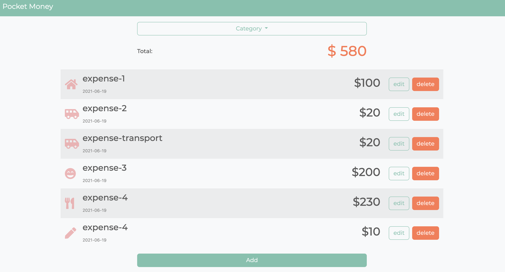
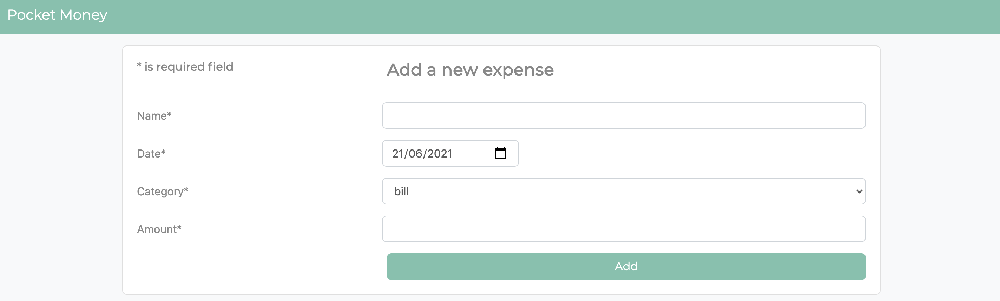
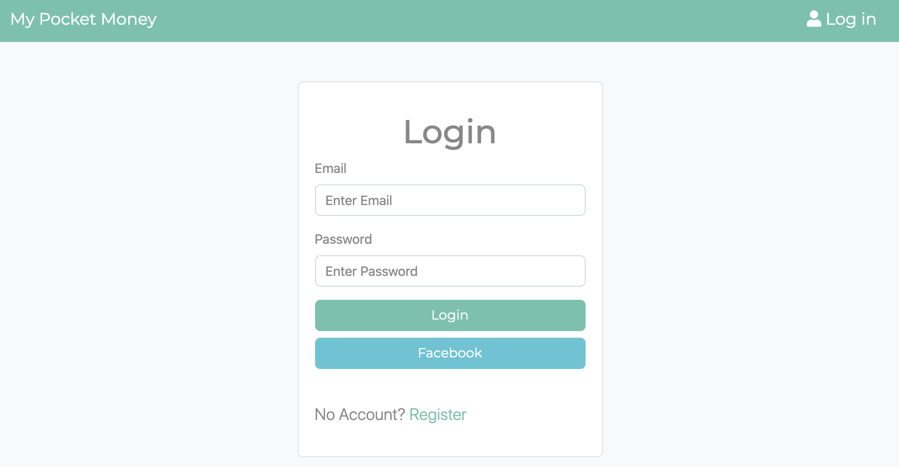

# Pocket Money

Pocket Money is an app that helps you keep on track on your expense

## URL

https://intense-basin-35259.herokuapp.com/

## Feature

- Show a list of list at landing page
- Dropdown to filter out different category
- Add a new expense record
- Delete an exist expense record
- Edit an exist expense record
- Register user account with email
- Register user account with facebook

## Getting Started

Clone repository

    git clone https://github.com/heidichen90/expense-tracker.git

Install Dependencies

    npm install

Spin up server

if you have nodemon

    npm run dev

if you don't have nodemon

    npm run start

The website should start running on

    http://localhost:3000/

Load up seed data

    npm run seed

## Author

Heidi Chen
